# Large Language Models with Cloudera
**Hands on Lab for Cloudera Machine Learning**

:wave: and welcome.

### Overview
The goal of this hands-on lab is to explore and interact with a real LLM application. Additionally, we gain experience in configuring components of the application for the given task and performance desired. In a real-world scenario, changing business requirements and technology advancements necessitate agility in interchanging these components. 

To begin we consider the LLM life cycle. This is a simplified view but helps us highlight some of the key components we need to consider when designing our LLM application. 

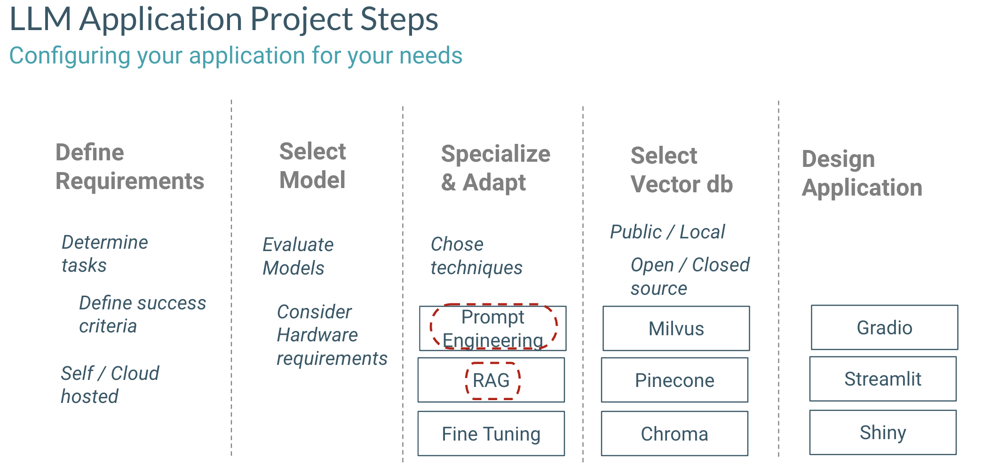

From left to right we see the major phases. Under each phase we see some considerations that need to be made. 
After defining your use case requirements, which includes success criteria, four key decisions to be made are

1. Model Selection
2. Model Adaptation (Fine-tuning, RAG, More)
3. Vector Database selection (if using RAG)
4. Application Choice

This view considers not only the intial design of the LLM application, but one that allows for your application to adapt and evolve over time. For example, newer more performant models may be released that may benefit you application. This same might be true for new vector databases.  

### Lab Flow

Ultimately the lab aims to demonstrate the ease and flexibility in which users can build and modify end to end LLM applications.

This lab is broken up into the following 7 sections.

- [Large Language Models with Cloudera](#large-language-models-with-cloudera)
    - [Overview](#overview)
    - [Lab Flow](#lab-flow)
      - [Getting into CML](#getting-into-cml)
      - [1. Exploring Amazon Bedrock through CML](#1-exploring-amazon-bedrock-through-cml)
        - [Defining how Claude will work and respond](#defining-how-claude-will-work-and-respond)
        - [Model Parameters](#model-parameters)
      - [2. Scrape and ingest data and populate Pinecone DB](#2-scrape-and-ingest-data-and-populate-pinecone-db)
      - [3. Explore your data via Pinecone DB](#3-explore-your-data-via-pinecone-db)
      - [4. Deploy a CML application](#4-deploy-a-cml-application)
        - [Deploying your application via the UI](#deploying-your-application-via-the-ui)
        - [Application script](#application-script)
        - [Deploying your application through the API.](#deploying-your-application-through-the-api)
        - [Interacting with Application](#interacting-with-application)
      - [5. Switch Vector DB to Chroma DB](#5-switch-vector-db-to-chroma-db)
      - [6. Langchain](#6-langchain)
      - [7. Use a locally hosted LLama2 model](#7-use-a-locally-hosted-llama2-model)
      - [8. Launch Final Application](#8-launch-final-application)
      - [9. Instruction Following](#9-instruction-following)

#### Getting into CML

Your link will take you direction to the screen where you can manage access all you data services. 

Click on the "Machine Learning" icon.

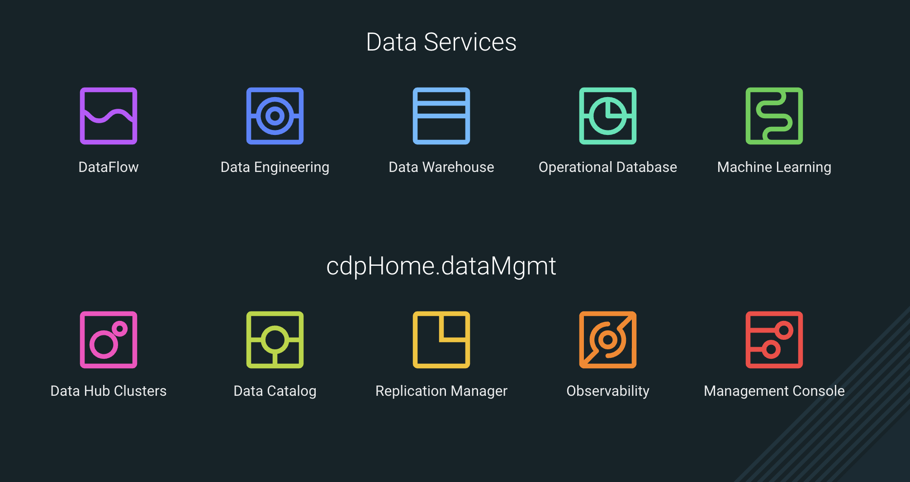

#### 1. Exploring Amazon Bedrock through CML

In this first section, we'll interact with a model (Anthropic's Claude) via Amazon's Bedrock in a jupyter notebook environment from within CML.

Start a session as follows:

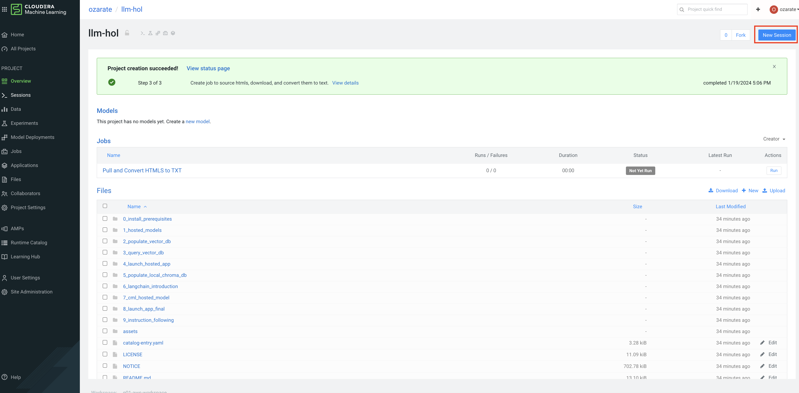

Open a Jupyter session with python 3.10. No need for a GPU.

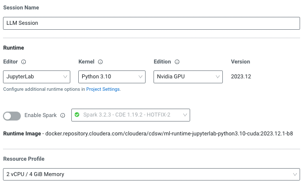

Open the following folder:

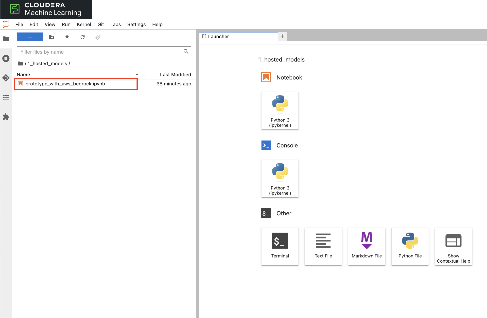

and jupyter notebook file:

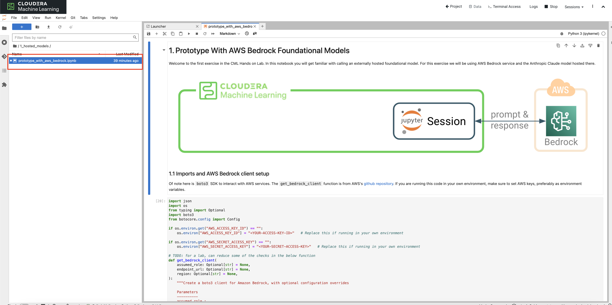

We begin by setting up our bedrock client. At this point your AWS credentials have already been set up as environment variables. 

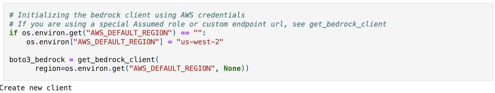

##### Defining how Claude will work and respond
In this section we'll provide instructions to the model - how we would like it to respond to our prompts. In this case we are asking it to provide a summary of input text. Try playing with these settings by changing the input text, or even in the instuctions in how you would like Claude to responde to your prompts.

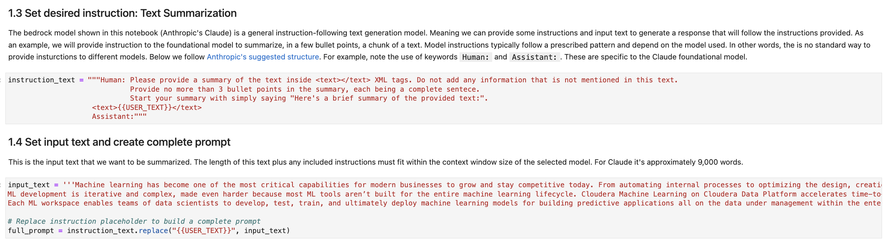

##### Model Parameters
The key to generative AI is in its ability to generate fresh new content. There are multiple 'knobs' we have available to modify how random (or perhaps creative) the model response can be. Try playing with the following to see if you can see model response behaviour changing. If we consider the model's - next word prediction to a softmax out, we can modify how the model picks from this distribution: 
- Temperature - The value of 1 leaves the distribution unchanged. Higher values will flatten the distribution, while lower values increase already higher weight predictions.
- Top k - Limits the model's selection of word responses to the top k most probable
- Top p - Limits the model's selection of the word responses to the top p percent of the distribution
  

#### 2. Scrape and ingest data and populate Pinecone DB

In this section we'll see the power of CML as we run job to scrape the data we'd would like to add to our knowledge base, and then a second job that populates the pincone vector database. The first job - Pull and Convert HTMLS to TXT - has already been created for you at setup. 

**Scraping web data**
For this exercise html links are already provided in folder 2_populate_vector_db in a file called 'html_links.txt'. There are 5 links to various subdomains of :
https://docs.cloudera.com/machine-learning/cloud/
Anytime you point to a new location(s) you can update this file and then rerun the scraping job.

As mentoioned earlier, when the project was a created a job was also created to run this scraping job. See below, but don't run it yet.

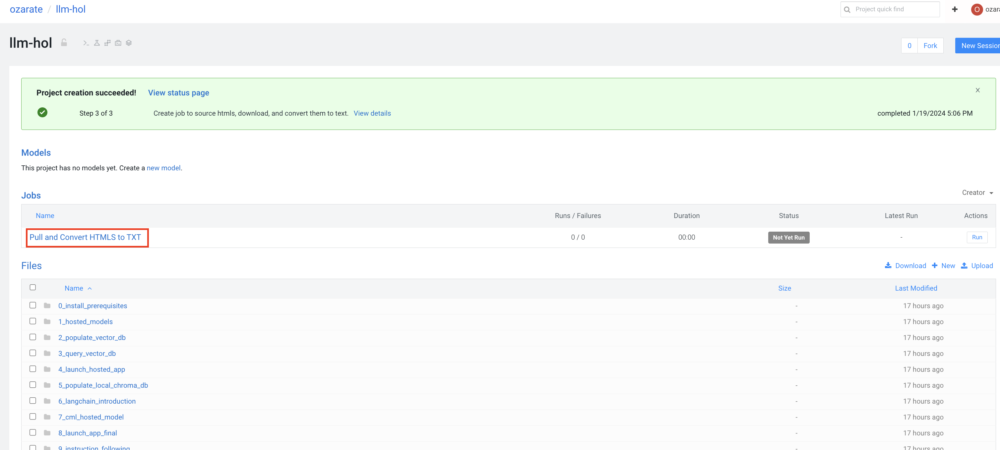

**Loading Pinecone**
In this lab, we'll look at a number of ways to populate our vector database of choice. We'll review the following

- Through a CML job
- Through a script
- Generating a job and running it programatically 

In production you would likely opt for the second or third option. For this excerise, it's useful create a job through the ui so we can understand the process a bit better. 

Let's begin by looking for the job section withing or project. Click "Jobs":

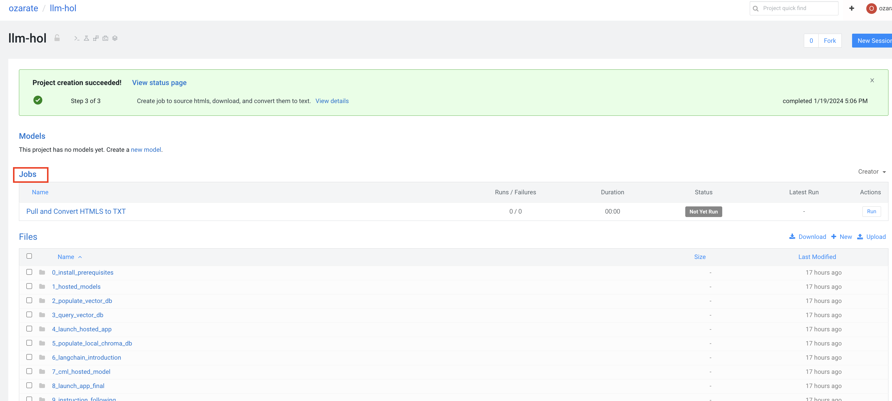

 And then select "New Job":

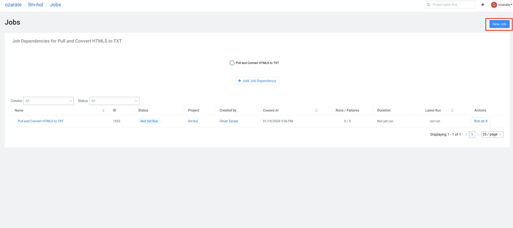

Once you see the following sreen name the job. We then need to assign the script - (pinecone_vectordb_insert.py), the drop down will allow you to provide teh full path. CML Jobs are an extremely easy way to schedule jobs to run at certain times or on a dependency another job. In fact we'll be creating this job as a dependency to the other job already created for you. Under Schedule, select "Dependent", then select the job "Pull and Convert HTMLS to TXT". Finally click "Create Job"
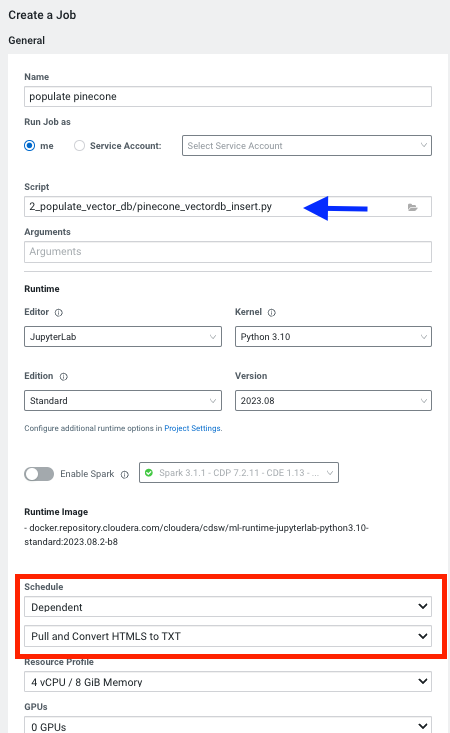

Great! Now you've created your own job! We can now run the scraping job "Pull and Convert HTMLS to TXT", and the populate vector database job will kick off automatically after that. 

Go back to "Jobs" (as shown above), you will see the following, and then click on "run as" for the "Pull and Convert HTMLS to TXT" job. 

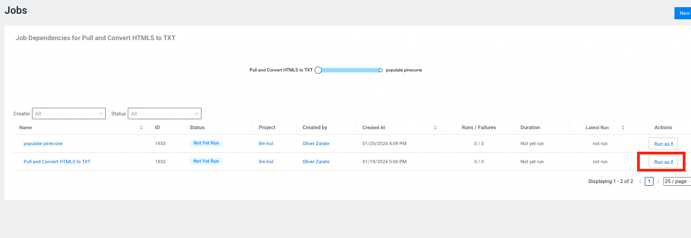

Make sure you confirm both jobs ran succesfully:

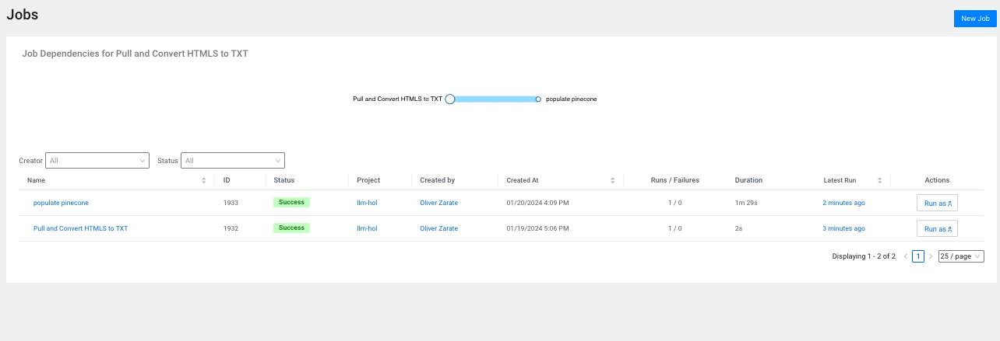

#### 3. Explore your data via Pinecone DB

We will now get to explore our new knowlege base. Return to the session you created in step 1. We will use the following file: pinecone_vectordb_query.ipynb. Follow the path shown below:

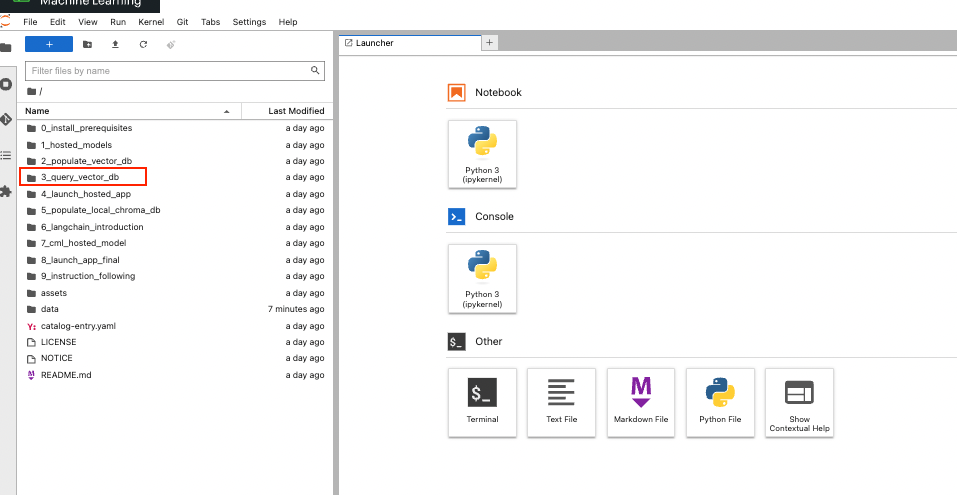

Then open the following file:

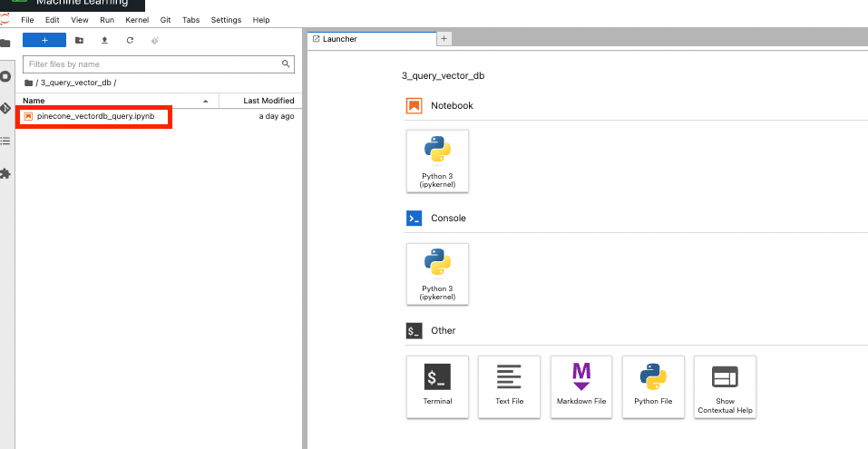

There are two functions we'll use to help us execute the query. 

- **get_nearest_chunk_from_pinecone_vectordb** - this function takes a user question and queries the Pinecone vector database to find the most relevant knowledge base content. This starts by embedding the question. Then we look for a hit on top 5 matches based on vector similarity. Finally a file path, mapping to original content is identified along with similarity score. 
- **load_context_chunk_from_data** - this function handles the responce once the filepath (or search result) has been idenfied with earlier function.
- 
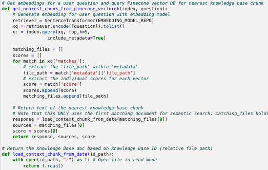

Try interacting with your vector db. You can ask it different questions about your data.

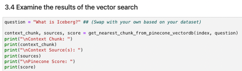

#### 4. Deploy a CML application

So far we have interacted with our models and vector database through a jupyter notebook. Now lets see how an a user might interact with an LLM solution through a CML application. CML supports a large number of solutions for deploying applications. In this lab we'll be deploying a gradio app to interact with the model. 

 In this lab we will deploy an application using the UI. We'll also explore how to do this programatically through the CML API. 

##### Deploying your application via the UI

On your project screen click on "Applications", click on new application (upper right corner).

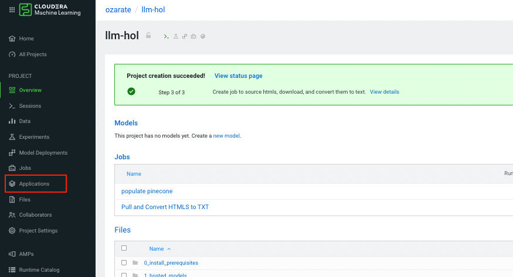

Create a new application:

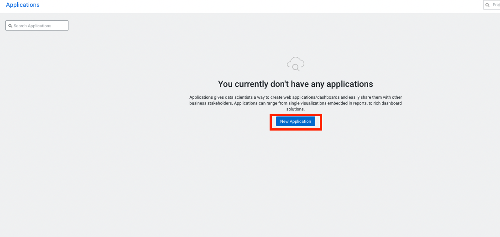

 See figure below for how to fill in the fields.

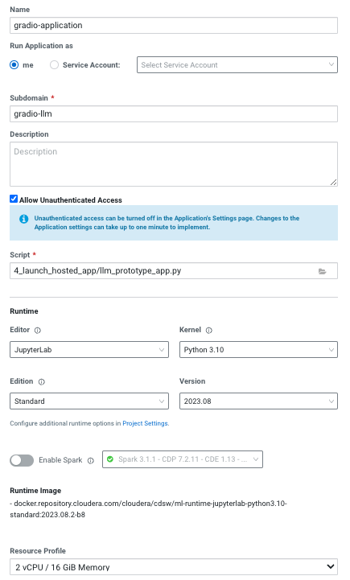

Note the path for the script that will be running the app. Lastly you do not need a GPU for this instance, as this application will not house the model but will call the model for inference.

##### Application script
Let's take a minute to see what's powering this application before we see the application. Open the folder 'llm_prototype_app.py'. You can access this from the overview page by following the path below:

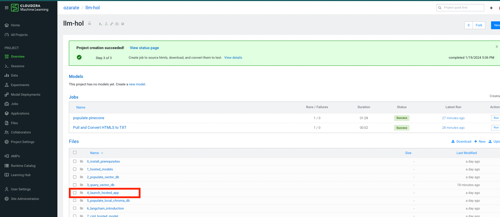

See the file below:

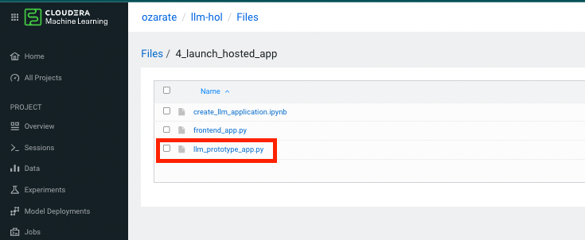

 The model defines endpoint url and access key variables (lines 42 and 43) which are then passed through to the bedrock client. 

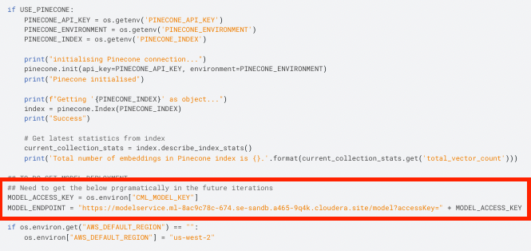

You might notice this script shares some functions with the code we used earlier to query our pinecone database. The new response function also considers which model the user selects to complete the response. This highlights the power of modularity in CML.

##### Deploying your application through the API. 
Next let's look at how an application can be deployed programatically. Go back to the session, you created in step 1, if still open. Follow the steps below ,following the folder path then the file to open.

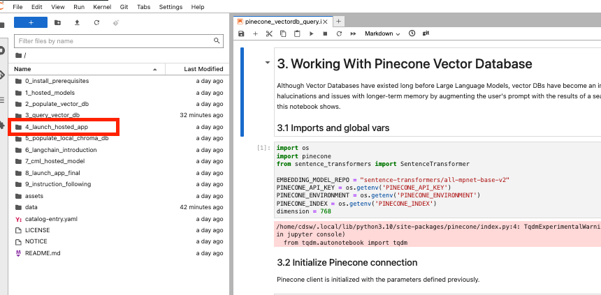

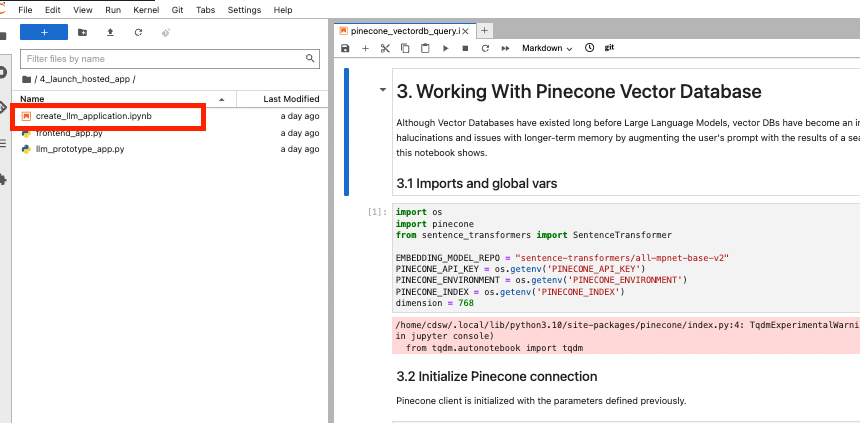

The notebook first sets up the conatainer runtime parameters for the application - the python version, GPU (if required), and editor. After this is complete the application build request is exectuted. Here we define the resources required, based on expected usage. Most importantly we define the script running the application.

##### Interacting with Application
Take some time to ask different questions about your data. You can try changing the available configurations. Here are some examples to start with. Note the first time we tried with no vector database, the model responds with no answer.

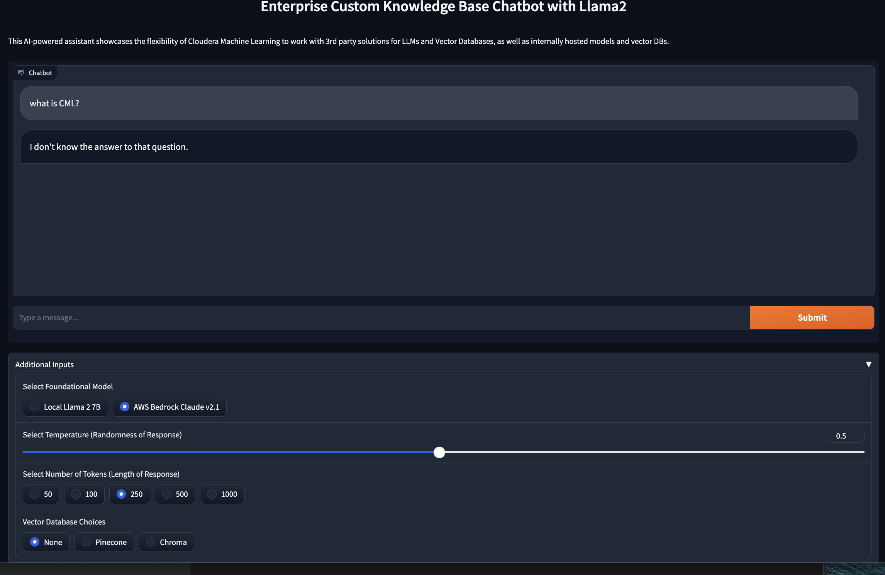
The second time however we are able to get a good answer to our question.
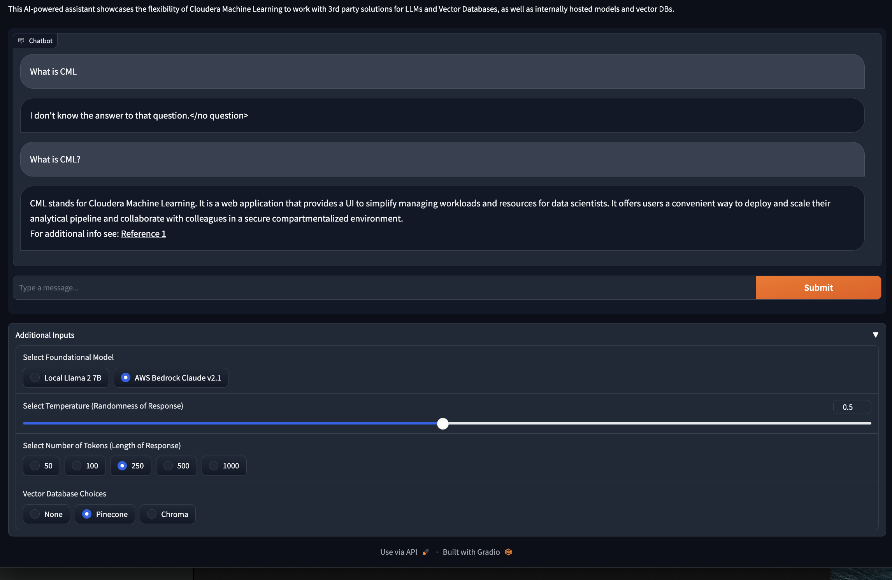

Try playing with some question/model/db/parameter combinations!

#### 5. Switch Vector DB to Chroma DB

We'll continue to expolore the CML's modularity for hosting LLM applications. We will nowswitch over to a Chroma DB. Pinecone is a public data store offering great scalablity. Chroma DB is open source and offers extensible querying. Fundementally, a good LLM application show offer design flexibility, by allowing users to switch out the models or vector db components per business requirements.

You will recall that earlier we created a new job using the UI. We will create a new job using the CML API. Using the API facilitates a programmatic approach to job creation and execution, offering significant advantages in terms of automation and workflow management. This method enhances the efficiency of job management, allowing for more streamlined and effective data processing. Once again, go to the session (started in step 1). If this session is not open, start a new session, with same paramters as step 1. Once in your session open the following path illustrated below:

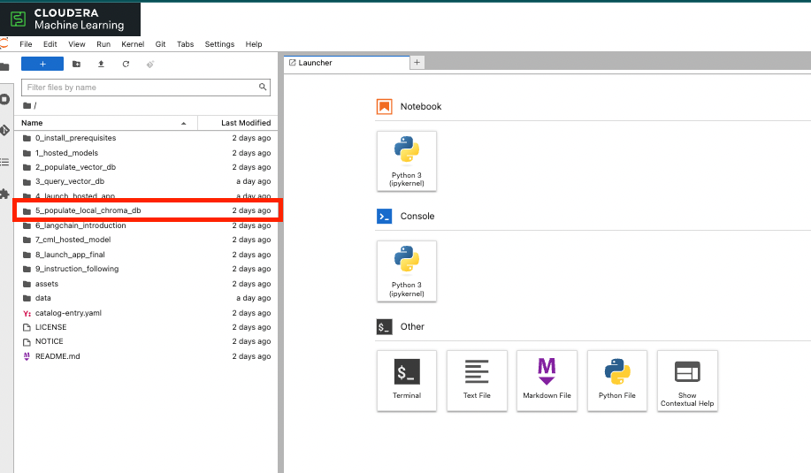

Open the following folder:

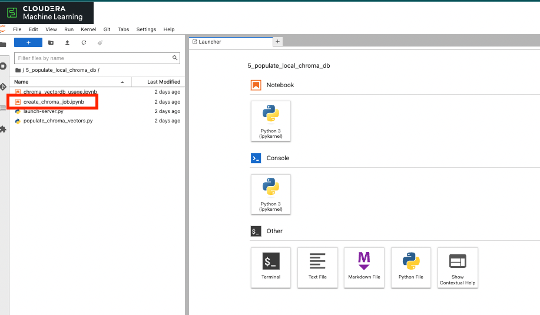

Under the folder "5_populate_local_chroma_db" open create_chroma_job.ipynb. 

Notice that first we set up a client and define a runtime for the job we can use in the future.

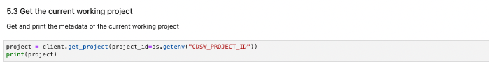

In the final step we create and run the job. This step points to the script responsible for the job (populate_chroma_vectors.py).

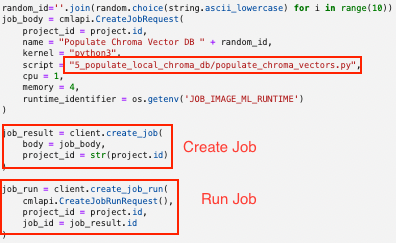

#### 6. Langchain

So far we have seen a number of components that come together to allow us to interact with our data - the model, the vector data base, the application, the code base, and finally the underlying platform. Langchain is a powerfull library that offers and flexible way to chain those (plus more) components together. In this lab we'll look at a particular use of lang chain, although it can be for more things such as agents that can take actions based on LLMs responses. For more information see : [Intro to Langchain](https://python.langchain.com/docs/get_started/introduction)

Use the same session, you used in the earlier step. Go into the folder (6_populate_local_chroma_db):

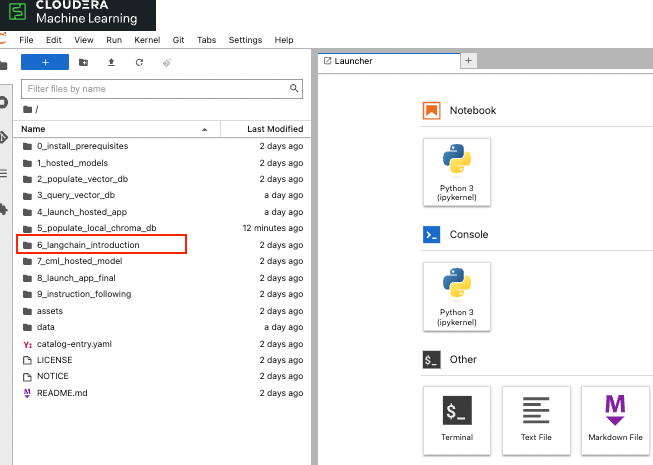

open the notebook called (Langchain_Bedrock_Chroma.ipynb):

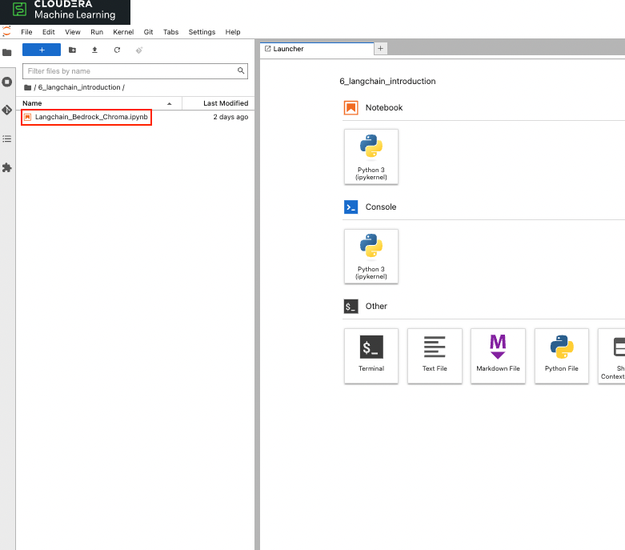

 In this section we'll be looking at using langchain to 'chain' together the following components:
- Amazon Bedrock
- Chroma vector data base
- Prompt Template

The beauty of using langchain for our example once we've created the chain object we do not have to rely on customer functions to query the vector store, then send path to LLM for a reponse. This is all done in a single function. The pieces of 'chain' can then be replaced when needed.

Below let's walk through how these components are chained together. First we start by creating the vector object:

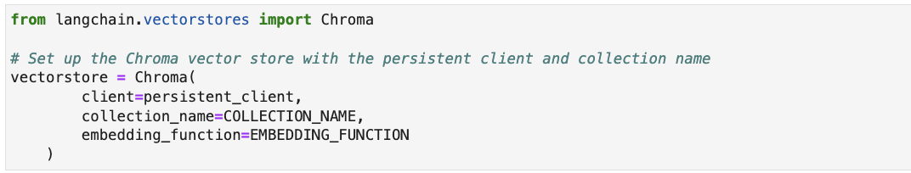

Then we create the llm object:

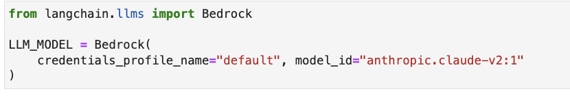

Next we create the prompt template. 

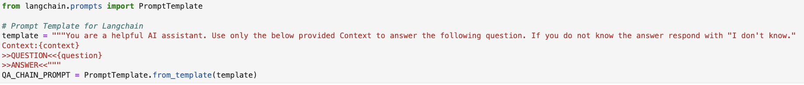 

Next we chain these together:

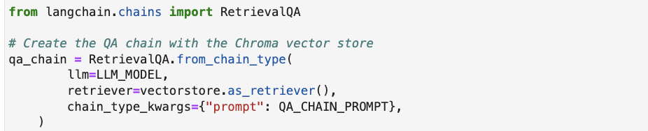

Finally we can see Lang Chain in action:

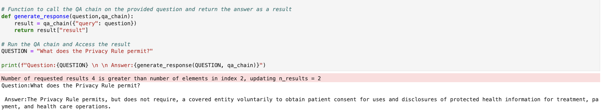

#### 7. Use a locally hosted LLama2 model

In this example we're going to look at yet another way of interacting with our deployed models. In earlier examples that used notebooks, we relied on code to aid in the process of our querying the vector db, then interacting with the model. We now look at a scenario that resembles how the interaction may take place in production - with a model and vector store already deployed. This is facilitated through the use of cml's apis. 

Once again going to our open Jupyter notebook session, follow the path below:

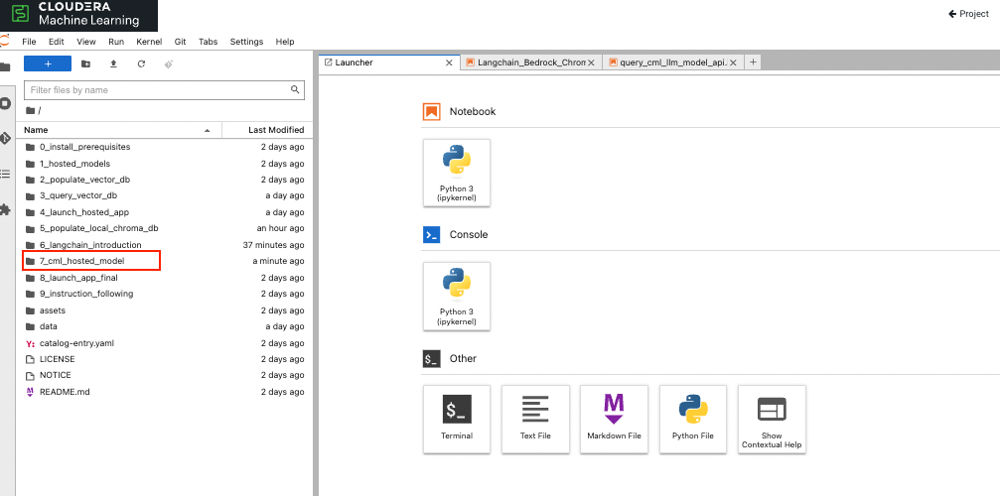

Open the following file:

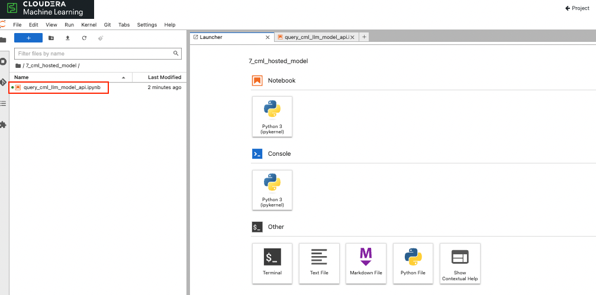

We begin this notebook, by setting up our client, then listing all open projects. Note the "CDSW_APIV2_KEY" environement variable has already been set for use and gives us access to workspace:

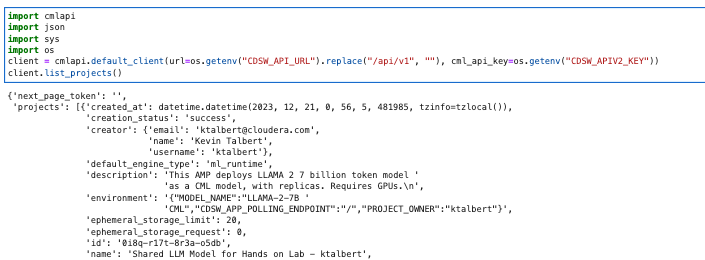

The next step is to filter by project name:

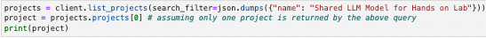

We use this step to get the project id. Using the project id, we then list the models deployed within the project:

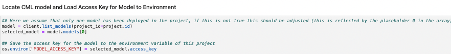

We now have the required api key for the modle of interest. Next let's get the model endpoint:

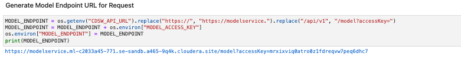

We are now ready to start using the endpoint to ask the model quesitons. Bleow we set up the various components of the prompt - instructions, tone, and the actual question:

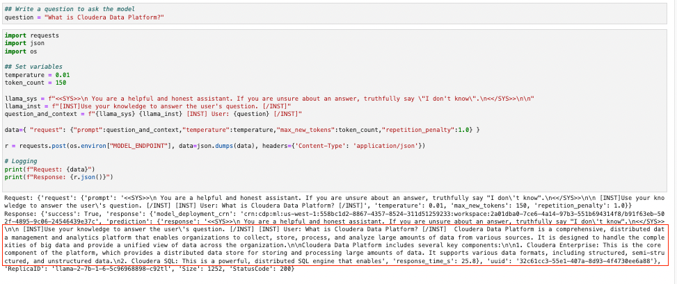

#### 8. Launch Final Application

We now are going to put all the pieces together into a final application that allows us to 
- Select our model
- Select our vector store of choice

This expemplifies the extensibility for LLM apps provided by CML. 

To get started, we're going to revisit the application that we created in step 4. 

a. Go to main project screen and click on applications, there you will see the application created in step 4 

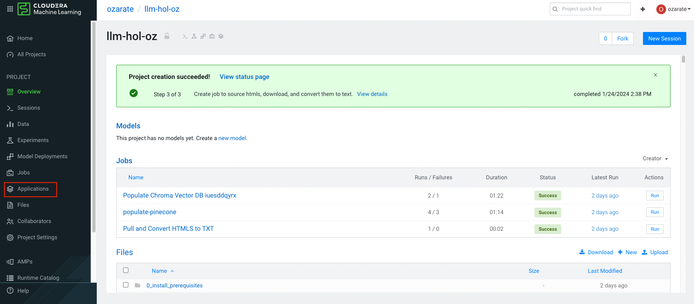

b. Click on the three dots on the top right hand corner and select "Application Details"

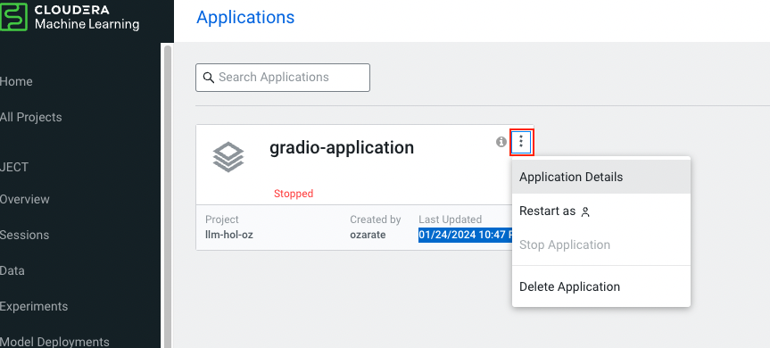

c. Select the top section "Settings". Now you are going to select the new file for the application. Click on the folder icon under the "Script" section. Then click on the file path:
 8_launch_app_final/llm_app_final.py

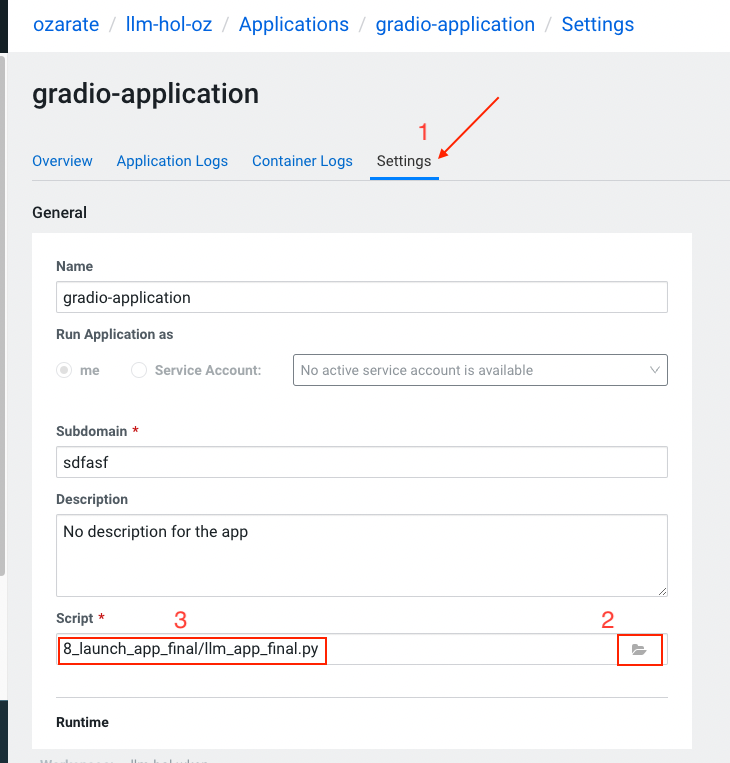

d. When done, click on "Update Application"

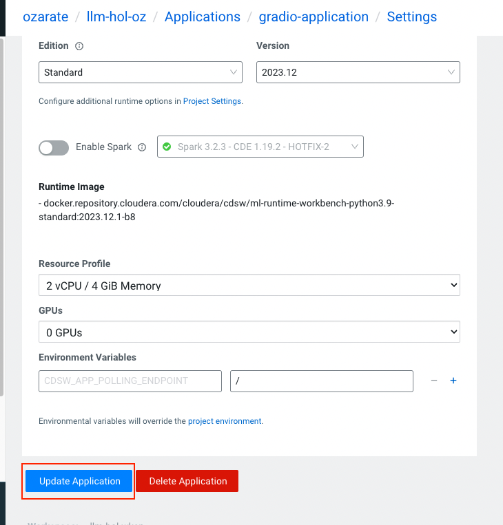

e. You're now taken to the actual application. Click on on the section called "Additional Inputs"

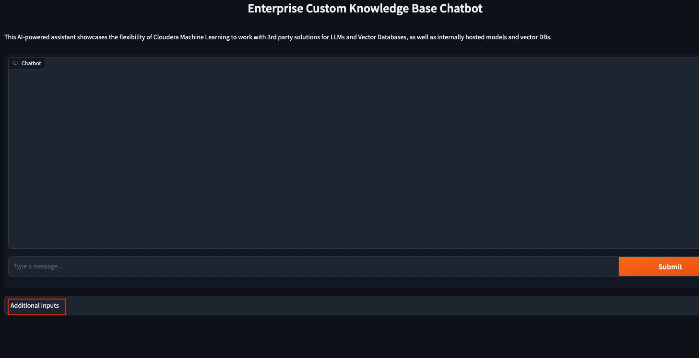

f. From here you can see that all application parameters available. Select the model, vector db, and other parameters of your choice

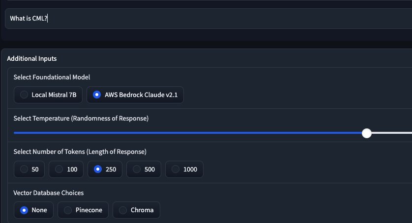

g. Finally, you're ready to start asking questions!

#### 9. Instruction Following

We'll now look at an example, that uses the Bloom model for instruction following. For this section you'll need a session with a GPU.

 We will instructing the model to classify a review as positive or negatice. We will be using multi-shot approach, providing a few examples of reviews along with actual positive or negative rating. 

What we are testing is the ability for the LLM model to learn to review will (according to our labeled data) under a three seperate multi-shot prompt scenarios. Then for each scenario, the prompted model is asked to clasify the entire dataset with and finally and accuracy score is calculated. We can see that going from prompt 1 to 2 saw an inrease while going from prompt 2 to 3 saw a signicat drop.  

