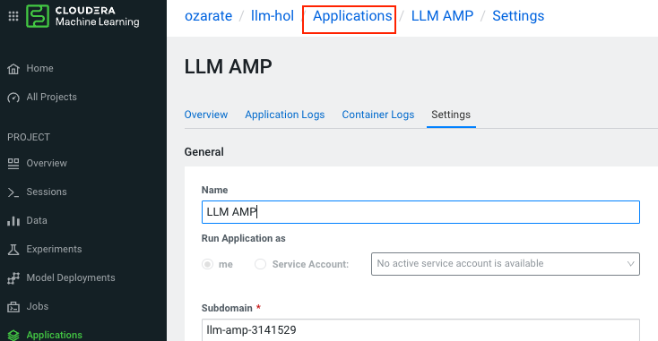

# Large Language Models with Cloudera

The goal of this hands-on lab is to explore Cloudera Machine Learning (CML) through the lens of LLM RAG architecture. Starting from a simple Jupyter notebook and finishing with a complete chatbot application, participants will get to know some of the key CML features and advantages. In a real-world scenario, changing business requirements and technology advancements necessitate agility and CML is a great tool to provide that to Data Science practitioners. 

Because the applications of LLMs can be quite broad across industries, it is useful to hone in on a particular use case for the purposes of this lab. 

> **Lab use case:** Software vendor is looking to pilot an LLM-based chat interface to improve employee productivity when searching product documentation. 
 
## Lab Flow

Ultimately the lab aims to demonstrate the ease and flexibility in which users can prototype new approaches and integrate them into fully-packages solutions like LLM applications.

There are currently 8 exercises in the lab, and others will be added soon. It is important to follow the exercise order, as there are dependencies between different stages. 
  - [0. Getting into CML](#getting-into-cml)
  - [1. Exploring Amazon Bedrock through CML](#1-exploring-amazon-bedrock-through-cml)
  - [2. Scrape and ingest data and populate Pinecone DB](#2-scrape-and-ingest-data-and-populate-pinecone-db)
  - [3. Explore your data via Pinecone DB](#3-explore-your-data-via-pinecone-db)
  - [4. Deploy a CML application](#4-deploy-a-cml-application)
    - [Deploying your application via the UI](#deploying-your-application-via-the-ui)
    - [Interacting with Application](#interacting-with-application)
    - [Application script](#application-script)
    - [Deploying your application through the API.](#deploying-your-application-through-the-api)
  - [5. Switch Vector DB to Chroma DB](#5-switch-vector-db-to-chroma-db)
  - [6. Langchain](#6-langchain)
  - [7. Use a locally hosted LLama2 model](#7-use-a-locally-hosted-llama2-model)
  - [8. Launch Final Application](#8-launch-final-application)

## 0. Getting into CML

Your SSO login link will take you direction to the home screen of Cloudera Data Platform. From here you can access CML - one of its Data Services.

> **0a.** Click on the "Machine Learning" icon.

> **0b.** Then click on ML Workspace called _llmhol-aw-wksp_ (the name may vary for your lab).


If you are new to CML, take a moment to explore available information through the dashboard.  

Concept of _projects_ is used to organize the workspace. Each project is typically linked to a remote repository (e.g. git) and can have multiple collaborators working on it. In the interest of time, a _Hands on Lab Workshop with LLM_ project has already been created for you and you are the sole _Owner_ of that project. 

> **0c.** When ready click into the project:


Take a moment to familiarize yourself with the project page. Notice that your project now has all required files (your code base), a readme below, project specific options in the left hand column, plus more. Throughout the lab you will use many of the features listed here.

## 1. Exploring Amazon Bedrock through CML

In this first section, we'll interact with a model (Anthropic's Claude) via Amazon's Bedrock service. To do this we will start a _Session_ with a Jupyter notebook UI. 

>**1a.** Start a session by clicking _New Session_ in the top right corner. Alternatively you can click on _Sessions_ in the sidebar and click _New Session_ there.


>**1b.** Give you session a name (e.g. "Jupyter Rocks!"). 
> For **Editor** select _JupyterLab_ 
> For **Kernel** select _Python 3.10_
> For **Edition** select _Nvidia GPU_ 
> Leave the other settings as is.


>**1c.** Click _Start Session_ in the bottom right.

>**1d.** After a few seconds your isolated compute pod, running Jupyter UI, with Python 3.10 Kernel and additional GPU libraries will be ready. 

>**1e.** A pop-up will open suggesting data connection code snippets to get started. You can select _Don't show me this again_ and close the pop-up window.

> **1f.** You will now see a familiar Jupyter notebook interface. In the left navigation panel go to ```1_hosted_models``` folder and open ```prototype_with_aws_bedrock.ipynb``` by double-clicking it.


>**1g.** As you walk through the notebook review the explanations and run each cell (you can use ```Enter+Shift``` or ```Command+Enter```). When you are finished going through the notebook come back to this guide. 


:pencil2: You have now gotten familiar with creating a CML session, working with JupyterLab editor and interacted with a 3rd party LLM provider. All within an isolated and secure compute pod.

## 2. Scrape and ingest data and populate Pinecone DB

In this section you will define a CML _Job_ to load text data into [Pinecone](https://www.pinecone.io/) vector database. Jobs are responsible for running scripts in a specific and isolated environment (just like sessions from exercise 1).  Jobs can can be scheduled, run on-demand, or be joined together into pipelines. 

For this exercise html links are already provided in  ```2_populate_vector_db/html_links.txt``` These sample links point to various pages of [Cloudera's CML documentation](https://docs.cloudera.com/machine-learning/cloud/). In this lab you have an option to point to other URL location(s) by updating this file. However, any time you update the links you will also need to rerun the job. 

**Loading Pinecone**
In this lab, we'll look at a number of ways to populate our vector database of choice. We'll review the following

- Through a CML job
- Through a script
- Generating a job and running it programatically 

In production you would likely opt for the second or third option. For this excerise, it's useful create a job through the ui so we can understand the process a bit better. 

CML Jobs are an extremely easy way to schedule jobs to run at certain times or on a dependency another job. In fact we'll be creating this job as a dependency to the other job already created for you. 

>**2a.** Note that your project already has one job, namely _Pull and Convert HTMLS to TXT_. This job will be a dependency of a new job you create.. See below, but don't run it yet.


>**2b.** In the left sidebar, click on _Jobs_


>**2c.** Press _New Job_ in the top right corner


>**2d.** On the next screen, give your job a name

>**2e.** Under **Script** browse to ```2_populate_vector_db/pinecone_vectordb_insert.py``` by clicking on the folder icon.

> **2f.** Ensure you've selected the right runtime settings, per below:
>  For **Editor** select _JupyterLab_ 
> For **Kernel** select _Python 3.10_
> For **Edition** select _Nvidia GPU_ 

>**2g.** Under **Schedule**, select _Dependent_, then select the job _Pull and Convert HTMLS to TXT_. 

> **2h.** Finally click _Create Job_, scrolling all the way down.

Great! Now you've created your very own CML job! We can now run the scraping job and the populate vector DB job will kick off automatically after that. 

>**2g.** Go back to _Jobs_ (as shown above in substep 2b)

>**2h.** Click the _Run as_ button for the _Pull and Convert HTMLS to TXT_ job. 


After just over a minute you should see both of your jobs completed successfully. While the job is running you can review the code in ```2_populate_vector_db/pinecone_vectordb_insert.py```


:pencil2: CML jobs give users an ability to automate recurrent tasks and streamline the workflow for a machine learning project. You have seen CML interact with a popular 3rd party vector database within an isolated compute framework. 

## 3. Explore your data via Pinecone DB

We will now get to explore our new knowlege base. 

>**3a.** Return to the session you created in step 1. Click on Sessions in the left sidebar and click on the session you created at the beginning. 

>**3b.**  We will use the following directory *2_populate_vector_db*


>**3c.** Open the following file : *pinecone_vectordb_query.ipynb*


Below are addition details, but you can follow instructions contained in the notebook as a main guide. 
There are two functions we'll use to help us execute the query. 

- **get_nearest_chunk_from_pinecone_vectordb** - this function takes a user question and queries the Pinecone vector database to find the most relevant knowledge base content. This starts by embedding the question. Then we look for a hit on top 5 matches based on vector similarity. Finally a file path, mapping to original content is identified along with similarity score. 
- **load_context_chunk_from_data** - this function handles the responce once the filepath (or search result) has been idenfied with earlier function.


Try interacting with your vector db. You can ask it different questions about your data.


## 4. Deploy a CML application

So far we have interacted with our models and vector database through a jupyter notebook. Now lets see how an a user might interact with an LLM solution through a CML application. CML supports a large number of solutions for deploying applications. In this lab we'll be deploying a gradio app to interact with the model. 

 In this lab we will deploy an application using the UI. We'll also explore how to do this programatically through the CML API. 

### Deploying your application via the UI

>**4a.** On your project screen click on "Applications", click on new application (upper right corner).


>**4b.** Create a new application:


 See figure below for how to fill in the fields.

 >**4c.** Name your application. Here we name it 'LLM APP"
 >**4d.** Pick a subdomain name. This needs to be unique.
>**4d.** Select the following path for your application script:
> *4_launch_hosted_app/llm_prototype_app.py*
**4e.** For resource profile, select 2 vCPU / 4 GB Memory
**4f.** Click "Launch Application

**Note please ensure you've selected the right container settings. You application will not work otherwise.**
- **Editor:** Jupyter Notebook
- **Kernal:** Python 3.10
- **Edition:** Nvidia GPU


Lastly you do not need a GPU for this instance, as this application will not house the model but will call the model for inference.

>**4g.** 

### Interacting with Application
Now let's set what the application can do. 

>**4h.** Return to the application, by clicking "Applications" on the top link, and then click on the app. Make sure the app has successfully been deployed. 



Check to confirm your app has completely deployed. You should see a message confirming.


Take some time to ask different questions about your data. Also, note the parameters towards the bottom that you can configure to change the way your application responds


Try playing with some question/model/db/parameter combinations!

### Application script
Let's take a minute to see what's powering this application. 

>**4i.** In the main project page, Open the folder *4_launch_hosted_app*


>**4j.** Open the following file *llm_prototype_app.py*


 The model defines endpoint url and access key variables (lines 42 and 43) which are then passed through to the bedrock client. 


You might notice this script shares some functions with the code we used earlier to query our pinecone database. The new response function also considers which model the user selects to complete the response. This highlights the power of modularity in CML.

### Deploying your application through the API. 
Next let's look at how an application can be deployed programatically. Go back to the session, you created in step 1, if still open. Follow the steps below ,following the folder path then the file to open.


The notebook first sets up the conatainer runtime parameters for the application - the python version, GPU (if required), and editor. After this is complete the application build request is exectuted. Here we define the resources required, based on expected usage. Most importantly we define the script running the application.

## 5. Switch Vector DB to Chroma DB

We'll continue to explore CML's modularity for hosting LLM applications. We will now switch over to a Chroma DB. Pinecone is a public data store offering great scalability. Chroma DB is open source and offers extensible querying. Fundamentally, a good LLM application offers design flexibility, by allowing users to switch out the models or vector db components per business requirements.

You will recall that earlier we created a new job using the UI (in step 2). Now we will create a new job using the CML API. Using the API facilitates a programmatic approach to job creation and execution, offering significant advantages in terms of automation and workflow management. This method enhances the efficiency of job management, allowing for more streamlined and effective data processing. 

>**5a.** Go to the session (started in step 1c). If this session is not open, start a new session, with the same parameters as step 1c. Once in your session open the following path illustrated below:

>**5b.** Open the folder called *5_populate_local_chroma_db*:


>**5c.** Open the notebook called *create_chroma_job.ipynb*: 


>**5d.** Below are addition details, but you can follow instructions contained in the notebook as a main guide. 


Notice that first we set up a client and define a runtime for the job we can use in the future.


In the final step we create and run the job. This step points to the script responsible for the job (populate_chroma_vectors.py).


 To confirm the job completed successfully, go to Jobs and you should see Success next to the Populate Chroma Vector DB jo”

## 6. Langchain

So far we have seen a number of components that come together to allow us to interact with our data - the model, the vector data base, the application, the code base, and finally the underlying platform. Langchain is a powerful library that offers a flexible way to chain those (plus more) components together. In this lab we'll look at a particular use of lang chain, although it can be for more things such as agents that can take actions based on LLMs responses. For more information see : [Intro to Langchain](https://python.langchain.com/docs/get_started/introduction)

>**6a.** Go to the session (started in step 1c).

>**6b.** Go into the folder *6_populate_local_chroma_db*:


>**6c.** Open the notebook called Langchain_Bedrock_Chroma.ipynb:


 In this section we'll be looking at using langchain to 'chain' together the following components:
- Amazon Bedrock
- Chroma vector data base
- Prompt Template

The beauty of using langchain for our example once we've created the chain object we do not have to rely on customer functions to query the vector store, then send path to LLM for a reponse. This is all done in a single function. The pieces of 'chain' can then be replaced when needed.

>**6d.** Below are addition details, but you can follow instructions contained in the notebook as a main guide. 

Below let's walk through how these components are chained together. First we start by creating the vector object:


Then we create the llm object:


Next we create the prompt template. 

 

Next we chain these together:


Finally we can see Lang Chain in action:


## 7. Use a locally hosted LLama2 model

In this section we're going to look at yet another way of interacting with our deployed models. In earlier examples that used notebooks, we relied on code to aid in the process of our querying the vector db, then interacting with the model. We now look at a scenario that resembles how the interaction may take place in production - with a model and vector store already deployed. This is facilitated through the use of cml's apis. 

>**7a.** Go to the session (started in step 1c).

>**7b.** Go into the folder *7_cml_hosted_model*:


>**7c.** Open the notebook called *query_cml_llm_model_api.ipynb*:


>**7d.** Below are addition details, but you can follow instructions contained in the notebook as a main guide. 

We begin this notebook, by setting up our client, then listing all open projects. Note the "CDSW_APIV2_KEY" environement variable has already been set for use and gives us access to workspace:


The next step is to filter by project name:


We use this step to get the project id. Using the project id, we then list the models deployed within the project:


We now have the required api key for the modle of interest. Next let's get the model endpoint:


We are now ready to start using the endpoint to ask the model quesitons. Bleow we set up the various components of the prompt - instructions, tone, and the actual question:


## 8. Launch Final Application

We now are going to put all the pieces together into a final application that allows us to 
- Select our model
- Select our vector store of choice

This expemplifies the extensibility for LLM apps provided by CML. 

To get started, we're going to revisit the application that we created in step 4. 

>**8a.** Go to main project screen and click on applications, there you will see the application created in step 4 


>**8b.** Click on the three dots on the top right hand corner and select "Application Details"


>**8c.** Select the top section "Settings". Now you are going to select the new file for the application. Click on the folder icon under the "Script" section. Then click on the file path:
 8_launch_app_final/llm_app_final.py


>**8d.** When done, click on "Update Application"


>**8e.** You're now taken to the actual application. Click on on the section called "Additional Inputs"


>**8f.** From here you can see that all application parameters available. Select the model, vector db, and other parameters of your choice


>**8g.** Finally, you're ready to start asking questions!
