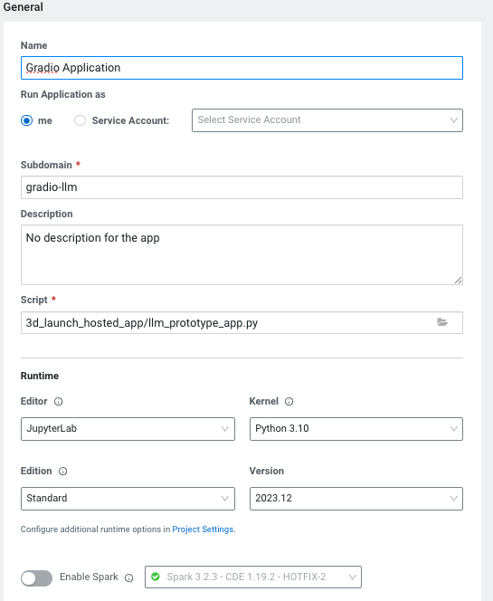

# Large Language Models with Cloudera
**Hands on Lab for Cloudera Machine Learning**

:wave: and welcome.

### Overview
The goal of this hands-on lab is to explore and interact with a real LLM application. Additionally, we gain experience in configuring components of the application for the given task and performance desired. In a real-world scenario, changing business requirements and technology advancements necessitate agility in interchanging these components. 

To begin we consider the LLM life cycle. This is a simplified view but helps us highlight some of the key components we need to consider when designing our LLM application. 

From left to right we see the major phases. Under each phase we see some considerations that need to be made. 
After defining your use case requirements, which includes success criteria, four key decisions to be made are

1. Model Selection
2. Model Adaptation (Fine-tuning, RAG, More)
3. Vector Database selection (if using RAG)
4. Application Choice

This view considers not only the intial design of the LLM application, but one that allows for your application to adapt and evolve over time. For example, newer more performant models may be released that may benefit you application. This same might be true for new vector databases.  

Ultimately the lab aims to demonstrate the ease and flexibility in which users can build and modify end to end LLM applications.

This lab is broken up into the following 7 sections.
This lab is broken up into the following 7 sections.

1. Exploring Amazon Bedrock through CML
2. Scrape and ingest data and populate Pinecone DB
3. Explore your data via Pinecone DB
4. Deploy a CML application
5. Switch Vector DB to Chroma DB
6. Langchain
7. Use a locally hosted LLama2 model.
8. Deploying Final Application
9. Instruction Following

### Exploring Amazon Bedrock through CML

In this first section, we'll interact with a model (Anthropic's Claude) via Amazon's Bedrock in a jupyter notebook environment from within CML.

We begin by setting up our bedrock client. At this point you should have already set up your AWS credentials as environment variables. 

#### Defining how Claude will work and respond
In this section we'll provide instructions to the model - how we would like it to respond to our prompts. In this case we are asking it to provide a summary of input text. Try playing with these settings by changing the input text, or even in the instuctions in how you would like Claude to responde to your prompts.

#### Model Parameters
The key to generative AI is in its ability to generate fresh new content. There are multiple 'knobs' we have available to modify how random (or perhaps creative) the model response can be. Try playing with the following to see if you can see model response behaviour changing. If we consider the model's - next word prediction to a softmax out, we can modify how the model picks from this distribution: 
- Temperature - The value of 1 leaves the distribution unchanged. Higher values will flatten the distribution, while lower values increase already higher weight predictions.
- Top k - Limits the model's selection of word responses to the top k most probable
- Top p - Limits the model's selection of the word responses to the top p percent of the distribution
  

### Scrape and ingest data and populate Pinecone DB

In this section we'll see the power of CML as we run job to scrape the data we'd would like to add to our knowledge base, and then a sectond job that populates the pincone vector database. The jobs have already been created for you at setup. Lets start by defining the HTML you'd like to gather data from.

**Scraping web data**
For this exercise html links are already provided in folder 2_populate_vector_db in a file called 'html_links.txt'. There are 5 links to various subdomains of :
https://docs.cloudera.com/machine-learning/cloud/
Anytime you point to a new location(s) you can update this file and then rerun the scraping job.

When this project was a created a job was also created to run this scraping job. See below, but don't run it yet.

**Loading Pinecone**
In this lab, we'll look at a number of ways to populate our vector database of choice. We'll review the following

- Through a CML job
- Through a script
- Generating a job and running it programatically 

In production you would likely opt for the second or third option. For this excerise, it's useful create a job through the ui so we can understand the process a bit better. 

Let's begin by looking for the job section withing or project. And then select "New Job"

Now let's look at the fields we need to complete for this job. Most importatnly is to point the job to the underlying script (pinecone_vectordb_insert.py). CML Jobs are an extremely easy way to schedule jobs to run a certain times or on a dependency another job. In fact that is what we will be doing now. So that each time new html urls are scraped the vector data base is also populated.

Great now, you've created your own job. However we can now run the scraping job to scrape or data, and the populate vector database job will kick off automatically after that. 

### Explore your data via Pinecone DB

We will now get to explore our new knowlege base. We will use the following file: pinecone_vectordb_query.ipynb. You will see in the cell titled 'Create a question for semantic search' you can define your question based on your data. 

There are two functions we'll use to help us execute the query. 

- **get_nearest_chunk_from_pinecone_vectordb** - this function takes a user question and queries the Pinecone vector database to find the most relevant knowledge base content. This starts by embedding the question. Then we look for a hit on top 5 matches based on vector similarity. Finally a file path, mapping to original content is identified along with similarity score. 
- **load_context_chunk_from_data** - this function handles the responce once the filepath (or search result) has been idenfied with earlier function.

Try interacting with your vector db. You can ask it different questions about your data.

### Deploy a CML application

So far we have interacted with our models and vector database through a jupyter notebook. Now lets see how an a user might interact with an LLM solution through a CML application. CML supports a large number of solutions for deploying applications. In this lab we'll be deploying a gradio app to interact with the model. 

There are a number of ways to deploy an application within CML. In this lab we will deploy an application using the UI. We'll also explore how to do this programatically through the CML API. 

#### Deploying your application via the UI

On your project screen click on "Applications", click on new application (upper right corner). See figure below for how to fill in the fields.
Note the path for the script that will be running the app. Lastly you do not need a GPU for this instance, as this application will not house the model but will call the model for inference.

#### Application script
Let's take a minute to see what's powering this application before we see the application. Open the folder '3d_launch_hosted_app.py'. The model defines endpoint url and access key varibles (lines 42 and 43) which are then passed through to the bedrock client. 

You might notice this script shares some functions with the code we used earlier to query our pinecone database. The new response function also considers which model the user selects to complete the response. This highlights the power of modularity in CML.

#### Deploying your application through the API. 
Next let's look at how an application can be deployed programatically. 
The notebook first sets up the conatainer runtime paramters for the application - the python version, GPU (if required), and editor. After this is complete the application build request is exectuted. Here we define the resources required, based on expected usage. Most importantly we define the script running the application.

#### Interacting with Application
Take some time to ask different questions about your data. You can try changing the available configurations. Here are some examples to start with. Note the first time we tried with no vector database, the model responds with no answer.

The second time however we are able to get a good answer to our question.

Try playing with some question/model/db/parameter combinations!

### Switch Vector DB to Chroma DB

We'll continue to expolore the modularity of the CML hosting of LLM applications. Now we switch over to a Chroma DB. Pinecone is a public data store offering great scalablity. Chroma DB is open source and offers extensible querying. Fundementally it is all about design flexibility, and being able to switch out model or vector db components per business requirements.

We consider the step using the CML API, which facilitates a programmatic approach to job creation and execution, offering significant advantages in terms of automation and workflow management. This method enhances the efficiency of job management, allowing for more streamlined and effective data processing. Under the folder "5_populate_local_chroma_db" open create_chroma_job.ipynb. 

Notice that first we set up a client and define a runtime for the job we can use in the future.
In the final step we create and run the job. This step points to the script responsible for the job (populate_chroma_vectors.py).

### Using Langchain

So far we have seen a number of components that come together to allow us to interact with our data - the model, the vector data base, the application, the code base, and finally the underlying platform. Langchain is a powerfull library that offers and flexible way to chain those (plus more) components together. In this lab we'll look at a particular use of lang chain, although it can be for more things such as agents that can take actions based on LLMs responses. For more information see : [Intro to Langchain](https://python.langchain.com/docs/get_started/introduction)

Go into the folder (6_populate_local_chroma_db), open the notebook called (Langchain_Bedrock_Chroma.ipynb) In this section we'll be looking at using langchain to 'chain' together the following components:
- Amazon Bedrock
- Chroma vector data base
- Prompt Template

We've seen the first two components in action so let's quickly discuss why Prompt templates might be useful. You've likely heard of prompt engineering which focuses on developing prompts that tailor the models responses to you requirements. A common example is to use few shots prompts, which essential provide the model with a few examples of how you expect it to respond to certain inputs. Additionally you can prompt a model to answer a certain way. As might ask a model to explain a concept in great detail or simplly an overview. All these prompts can be aided with the use of prompt templates.

The beauty of using langchain for our example once we've created the chain object we do not have to rely on customer functions to query the vector store, then send path to LLM for a reponse. This is all done in a single function. The pieces of 'chain' can then be replaced when needed.

### Use a locally hosted LLama2 model

In this example we're going to look at yet another dimension of interacting with our deployed models. In earlier examples that used notebooks, we relied on code to aid in the process our querying the vector db, then interacting with the model. We now look at a scenario that resembles how the interaction may take place in production - with a model and vector store in place. This is facilitate through the use of cml's apis. 

We begin this notebook, by setting up our client. We can list all the projects in the workspace, along wiht accompaning metadata. We show here how to get the model access key for the deployed LLM model. We then need to configer the json payload to make the appropriate call to the model endpoint. You can see that, in step 2 "Create Request to Model", there a few steps required to get to prepare the request for the model. And voila, you have proramatic way to easily interact with your model. If extend this to a use case, you could imaging multiple chatbot agents packaging requests and sending them to a single model.

### Launch Final Application

### Instruction Following

We'll now look at an example, that uses the Bloom model for instruction following. For this section you'll need a session with a GPU. We will instructing the model to classify a review as positive or negatice. We will be using multi-shot approach, providing a few examples of reviews along with actual positive or negative rating. 

What we are testing is the ability for the LLM model to learn to review will (according to our labeled data) under a three seperate multi-shot prompt scenarios. Then for each scenario, the prompted model is asked to clasify the entire dataset with and finally and accuracy score is calculated. We can see that going from prompt 1 to 2 saw an inrease while going from prompt 2 to 3 saw a signicat drop.  

